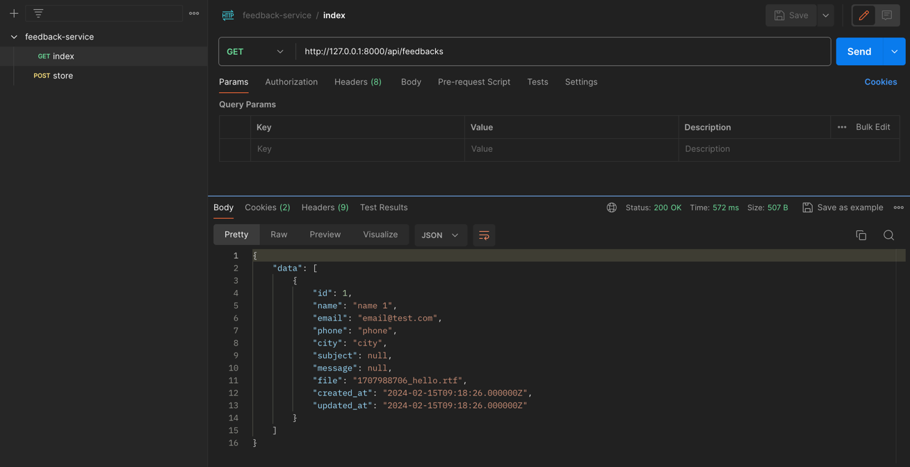
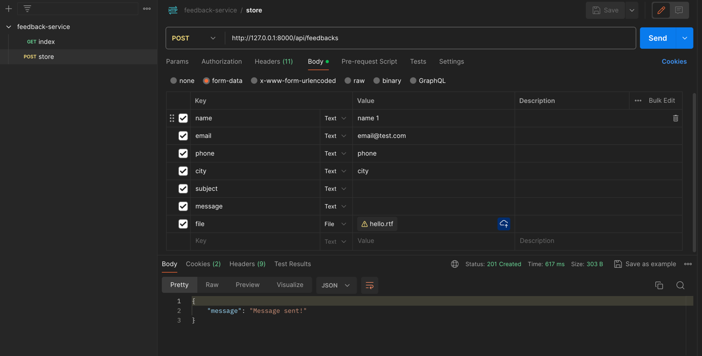

## About

1. download/clone the project.
2. run `composer install`.
3. run `docker-compose up -d --build`.
4. run `docker-compose exec app php artisan migrate`.
5. access https://127.0.0.1:8000.
6. docs http://127.0.0.1:8000/api/documentation#/default

